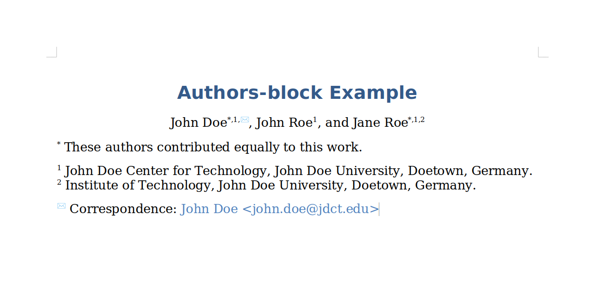

# Authors-block Extension For Quarto

<!-- badges: start -->
[](https://github.com/kapsner/authors-block/actions)
<!-- badges: end -->

This extension brings the capability to add an author-related header block when rendering docx-documents with Quarto.

The extension adds some modifications to the code originally provided with the lua-filters [scholarly-metadata](https://github.com/pandoc/lua-filters/tree/master/scholarly-metadata) (by Albert Krewinkel and Robert Winkler) and [author-info-block](https://github.com/pandoc/lua-filters/tree/master/author-info-blocks) (by Albert Krewinkel) in order to make it compatible with Quarto and its [normalized author-block](https://quarto.org/docs/journals/authors.html).  

## Installing

```bash
quarto add kapsner/authors-block
```

Using `authors-block` requires Quarto version >= 1.3.0

This will install the extension under the `_extensions` sub-directory.
If you're using version control, you will want to check in this directory.

## Using

<br>

<br>

## Example

Here is the source code for a minimal example: [example.qmd](example.qmd).

```yml
---
title: "Authors-block Example"

authors:
  - name: John Doe
    affiliations:
      - ref: jdct
    corresponding: true
    email: john.doe@jdct.edu
    orcid: 0000-1111-2222-3333
    equal-contributor: true
  - name: John Roe
    affiliations:
      - ref: jdct
    orcid: 0000-3333-2222-1111
  - name: Jane Roe
    affiliations:
      - ref: jdct
      - ref: iot
    orcid: 0000-2222-1111-3333
    equal-contributor: true

affiliations:
  - id: jdct
    name: John Doe Center for Technology, John Doe University, Doetown, Germany.
  - id: iot
    name: Institute of Technology, John Doe University, Doetown, Germany.

filters:
  - authors-block

format:
  docx: default
  pdf:
    keep-tex: true
---
```
